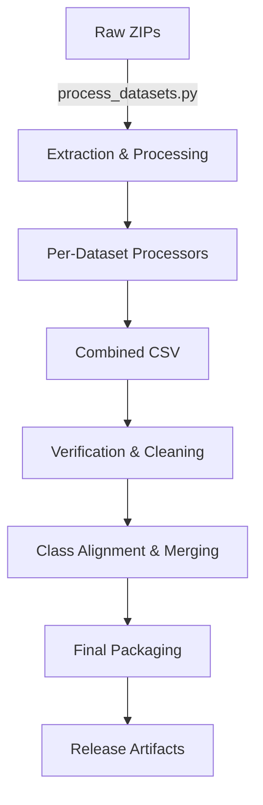

# Pipeline Overview

## Architecture

## Workflow Steps

### 1. Ingestion (`process_datasets.py`)
- **Extraction:** Unzips files using `pipeline/zip_utils.py`, handling Windows long paths and nested archives.
- **Processing:** Delegates to specific processors in `pipeline/` (e.g., `cassava.py`, `wheat.py`) to standardize folder structures and labels.
- **Aggregation:** Generates `combined_dataset.csv` containing metadata for all 196k+ raw images.

### 2. Validation & Cleaning (`scripts/verify_and_clean_dataset.py`)
- **Integrity:** Attempts to open every image with PIL to detect corruption.
- **Deduplication:** Calculates MD5 hashes for all images. Removes duplicates (same content, same label) to prevent data leakage between overlapping sources (e.g., PlantVillage vs. NewPlantDiseases).
- **Stratification:** Flags underrepresented classes (< 50 images).

### 3. Normalization (`notebooks/disease_normalisation.ipynb`)
- **Fuzzy Alignment:** Scans all class names to map synonyms (e.g., `Tomato_Early_Blight`, `Tomato_Early_Blight_Leaf`) to a single canonical ID.
- **Output:** Generates `foundation_class_alignment.csv`.

### 4. Merging (`scripts/execute_merges.py`)
- **Consolidation:** Physically moves folders based on the alignment report.
- **Refinement:** Merges search-engine scraped variants (e.g., `_google`, `_bing`) into their base biological classes.

### 5. Packaging (`scripts/package_for_release.py`)
- **Structure:** Copies valid, non-duplicate images to `data/release/agri_foundation_v1/data/{label}/{image}`.
- **Metadata:** Generates the final `metadata.csv` and `README.md`.

## Component Responsibilities

| Component | Responsibility |
|-----------|----------------|
| `pipeline/config.py` | Configuration constants and path resolution. |
| `pipeline/fs_utils.py` | Low-level file operations (long-path safe copy/delete). |
| `pipeline/data_utils.py` | Shared data utilities (CSV loading, Hashing). |
| `pipeline/*.py` | Dataset-specific logic (e.g., parsing `train.csv` for Cassava). |
| `scripts/` | High-level orchestration scripts for maintenance and release. |

## Dependencies

- **Core:** `pandas`, `tqdm`, `Pillow`
- **Optional:** `torchvision` (used in notebooks for loader verification)
- **Environment:** Designed for Windows (handles `\?\